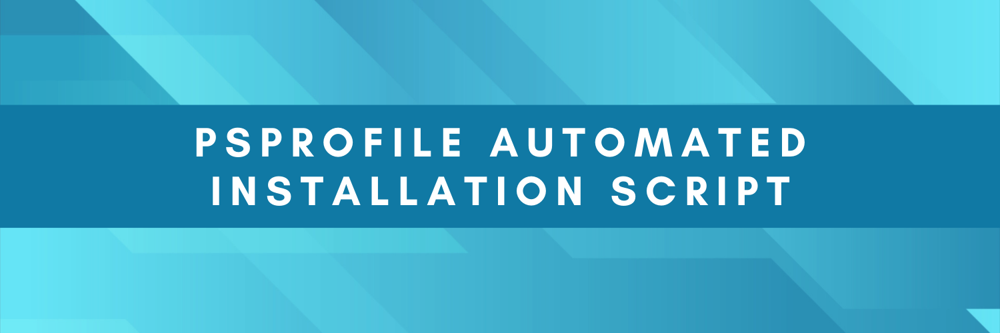

#

#
  
### Configure PowerShell Execution Policy.
If running script on a fresh installation of Windows, This MUST be run on PowerShell 5 and PowerShell 7.x

```Set-ExecutionPolicy -Scope CurrentUser -ExecutionPolicy RemoteSigned```

### Module Version Support | Get-PowerShellGet.ps1
Must have PowerShellGet Module above 1.6.0 - Otherwisew PowerShell 5.1 configuration fails to run.
Download the below file to check PowerShellGet and PackageManagement are Up-To-Date.

```Invoke-WebRequest -Uri 'https://raw.githubusercontent.com/smoonlee/powershell_profile/main/Check-PowerShellGet.ps1' -OutFile "$([Environment]::GetFolderPath("Desktop"))\Check-PowerShellGet.ps1"```


### Reset PSProfile Environment | Reset-PSProfile.ps1
If you have issues with your PSProfile configuation, You can download and execute this script. It will remove the following modules.
<p>'Oh-My-Posh, Posh-Git, PSReadLines (2.2.0)'</p>

```Invoke-WebRequest -Uri 'https://raw.githubusercontent.com/smoonlee/powershell_profile/main/Reset-PSProfileEnv.ps1' -OutFile "$([Environment]::GetFolderPath("Desktop"))\Reset-PSProfileEnv.ps1"```


### Install-PSProfile.ps1

#### PSProfile Script without NerdFont Assisted Installation (Requires manual Font installation from: [NerdFonts](https://www.nerdfonts.com/).

```Invoke-WebRequest -Uri 'https://raw.githubusercontent.com/smoonlee/powershell_profile/main/Install-PSProfile_NoNerdFonts.ps1' -OutFile "$([Environment]::GetFolderPath("Desktop"))\Install-PSProfile_NoNerdFonts.ps1"```


#### PSProfile Script with NerdFont Assisted Installation
``` Coming Soon ```


# > PowerShell Profile Path Locations
## PowerShell 5.1.x Profile Path 
#### Default 
```'C:\Users\\$Env:USERNAME\Documents\WindowsPowerShell\Microsoft.PowerShell_profile.ps1'```

#### PowerShell Path
```"$([Environment]::GetFolderPath("MyDocuments"))\WindowsPowerShell\Microsoft.PowerShell_profile.ps1"```

##  PowerShell 7.x 
#### Default 
```'C:\Users\\$Env:USERNAME\Documents\PowerShell\Microsoft.PowerShell_profile.ps1'```

### PowerShell Path
```"$([Environment]::GetFolderPath("MyDocuments"))\WindowsPowerShell\Microsoft.PowerShell_profile.ps1"```

## Visual Studio Code
#### Default 
```C:\Users\\$Env:USERNAME\Documents\Documents\PowerShell\Microsoft.VSCode_profile.ps1```

#### PowerShell Path
```"$([Environment]::GetFolderPath("MyDocuments"))\PowerShell\Microsoft.VSCode_profile.ps1"```
