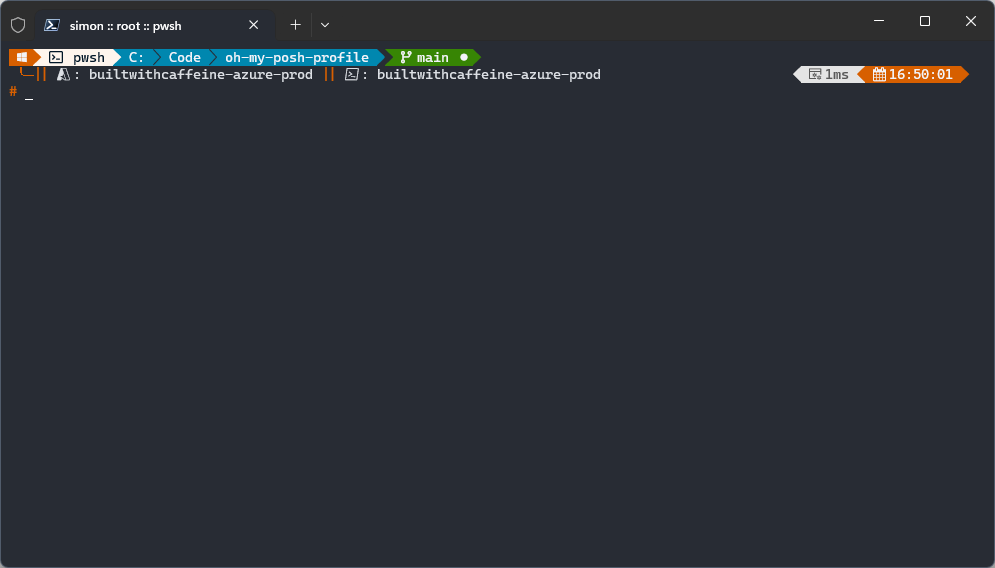

## Oh-My-Posh :: Overview
This repository contains my PowerShell Profile and the scripts to install the profile for Windows and Linux.



### Pre-requisite checks - winget modules
 - Microsoft.WindowsTerminal
 - Microsoft.PowerShell*
 - Microsoft.VisualStudioCode \
'*' If installed from winget it installs under `"C:\Program Files\PowerShell\7\pwsh.exe"`

### PowerShell Modules
 - PackageManagement [PowerShell 5.0]
 - PowerShellGet [PowerShell 5.0]
 - PSReadLine [PowerShell 5.0]
 - Pester [PowerShell 5.0] [PowerShell 7.0]
 - Posh-Git [PowerShell 5.0] [PowerShell 7.0]
 - Terminal-Icons [PowerShell 5.0] [PowerShell 7.0]
 - Az [PowerShell 5.0] [PowerShell 7.0]

During the installation of the PowerShell Modules they are installed to the `"%PROGRAMFILES%\WindowsPowerShell\Modules"` \
this allows for cross-version module import from PowerShell 5.1 and PowerShell 7.0

### Winget Modules
 - JanDeDobbeleer.OhMyPosh
 - Git.Git
 - Github.Cli
 - Microsoft.AzureCLI
 - Microsoft.Azure.Kubelogin
 - Kubernetes.kubectl
 - Helm.Helm

### Nerd Font Installation
Obviously using Oh-My-Posh required a [Nerd Font](https://www.nerdfonts.com/font-downloads) of choice. \
For this setup script, my chosen font is: [CaskaydiaCove Nerd Font](https://github.com/ryanoasis/nerd-fonts/releases/download/v3.0.2/CascadiaCode.zip) \
Specially this ttf font style: `*CaskaydiaCoveNerdFont-Regular.ttf*`

For the VSCode Font Family settings, you will want to use:
```
Consolas, 'Courier New', 'CaskaydiaCove Nerd Font'
```

## Oh-My-Posh :: Windows

<details>
<summary> New Device Setup </summary>
 
Check PowerShell Execution Policy - If Execution Policy is `Default` update to `RemoteSigned`
``` powershell
Get-ExecutionPolicy
```

Update Execution Policy
``` powershell
Set-ExecutionPolicy -Scope CurrentUser-ExecutionPolicy RemoteSigned 
```

Download PsProfile Script 
``` powershell
Invoke-WebRequest -Uri "https://raw.githubusercontent.com/smoonlee/oh-my-posh-profile/main/New-PsProfile.ps1" -OutFile "$([Environment]::GetFolderPath("Desktop"))\New-PsProfile.ps1" 
```
Execute Script
``` powershell
.\New-PsProfile.ps1
```
</details>

<details>
<summary> Reset Profile </summary>

Download PsProfile Script 
``` powershell
Invoke-WebRequest -Uri "https://raw.githubusercontent.com/smoonlee/oh-my-posh-profile/main/New-PsProfile.ps1" -OutFile "$([Environment]::GetFolderPath("Desktop"))\New-PsProfile.ps1" 
```
Execute Script
``` powershell
.\New-PsProfile.ps1 -ResetProfile
```

</details>


## Oh-My-Posh :: Linux

<details>
<summary> New Device Setup </summary>

``` bash
curl -s https://raw.githubusercontent.com/smoonlee/oh-my-posh-profile/main/New-BashProfile.sh -o $HOME/New-BashProfile.sh
```

Execute Script
``` bash
bash New-BashProfile.sh
```
</details>

<details>
<summary> WSL :: Kubernetes </summary>

You might need to create the `.kube` folder first
```
mkdir $HOME/.kube
```

Then create a symbolic link to the Windows `.kube` folder
```
ln -sf /mnt/c/Users/simon/.kube/config $HOME/.kube/config
```
</details>
