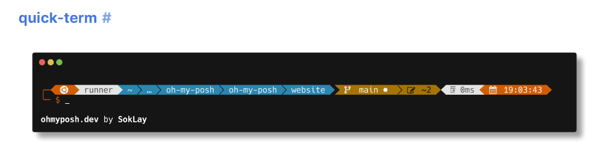

# Welcome to my Oh-My-Posh profile 2.1
We now have support for Windows and Linux and the setup steps to configure your terminal are now easier than ever. 🥳

## What is Oh-My-Posh?
Oh-My-Posh is a theme engine for any terminal that is able to display text. It was created to be easy to install and configure.

### Useful Links
Main Website: [https://ohmyposh.dev](https://ohmyposh.dev/) \
Oh-My-Posh Docs: [https://ohmyposh.dev/docs](https://ohmyposh.dev/docs/) \
Oh-My-Posh Themes: [https://ohmyposh.dev/docs/themes](https://ohmyposh.dev/docs/themes) \
Author: [Jan De Dobbeleer](https://twitter.com/JanDeDobbeleer)


### Base Theme 
The base theme I've adapted is the [quick-term](https://ohmyposh.dev/docs/themes#quick-term) theme created by [SokLay](https://github.com/soklaysam)



the added customisation is supporting `Azure Cli` `PowerShell` and `Azure Kubernetes` Contexts - which makes to alot easier when working with multiple customers and subscriptions and contexts.

## How to install Oh-My-Posh
### Windows
``` PowerShell
Invoke-WebRequest -Uri 'https://raw.githubusercontent.com/smoonlee/oh-my-posh-profile/main/New-PsProfile.ps1' -OutFile $Temp\New-PsProfile.ps1
```
### Linux
``` bash
wget https://raw.githubusercontent.com/smoonlee/oh-my-posh/main/New-BashProfile.sh -O /tmp/New-BashProfile.sh && sudo sh ./tmp/New-BashProfile.sh
```
```

## Oh-My-Posh Profile Configuration and Breakdown 
<details>
<summary> Oh-My-Posh - Windows </summary>

### Pre-requites Applications required: 
> Microsoft.WindowsTerminal \
> Microsoft.PowerShell \
> Microsoft.VisualStudioCode 
> 
<details>
<summary>Manual Installation of Packages</summary>

#### Microsoft.WindowsTerminal 
```
winget.exe install --exact --silent --id Microsoft.WindowsTerminal
```

#### Microsoft.PowerShell
```
winget.exe install --exact --silent --id Microsoft.PowerShell
```

#### Microsoft.VisualStudioCode
```
winget.exe install --exact --silent --id Microsoft.VisualStudioCode --scope machine
```
</details>

## New Computer Setup (Fresh OS Deployment)
During the setup of the PsProfile Script the following Packages will be installed on your local machine 

### Pre-requsite checks - winget modules (This will probably already be installed)
 - Microsoft.WindowsTerminal
 - Microsoft.PowerShell*
 - Microsoft.VisualStudioCode \
'*' If installed from winget it installs under `"C:\Program Files\PowerShell\7\pwsh.exe"`

### PowerShell Modules
 - PackageManagement [PowerShell 5.0]
 - PowerShellGet [PowerShell 5.0]
 - PSReadLine [PowerShell 5.0]
 - Pester [PowerShell 5.0]
 - Posh-Git [PowerShell 7.0] [PowerShell 5.0]
 - Terminal-Icons [PowerShell 7.0] [PowerShell 5.0]
 - Az [PowerShell 7.0] [PowerShell 5.0]

During the installation of the PowerShell Modules they are installed to the `"%PROGRAMFILES%\WindowsPowerShell\Modules"` \
this allows for cross-version module import from PowerShell 5.1 and PowerShell 7.0

### Winget Modules
 - JanDeDobbeleer.OhMyPosh
 - Git.Git
 - Github.Cli
 - Microsoft.AzureCLI
 - Microsoft.Azure.Kubelogin
 - Kubernetes.kubectl
 - Helm.Helm

### Nerd Font Installation
Obviously using Oh-My-Posh required a [Nerd Font](https://www.nerdfonts.com/font-downloads) of choice. \
For this setup script, my chosen font is: [CaskaydiaCove Nerd Font](https://github.com/ryanoasis/nerd-fonts/releases/download/v3.0.2/CascadiaCode.zip) \
Specially this ttf font style: `*CaskaydiaCoveNerdFont-Regular.ttf*`

For the VSCode Font Family settings you will want to use:
```
Consolas, 'Courier New', 'CaskaydiaCove Nerd Font'
```

### Installation Time

#### Download the zip file and extract 
```
Invoke-WebRequest -Uri "https://github.com/smoonlee/powershell_profile/archive/refs/heads/main.zip" -Outfile $([Environment]::GetFolderPath("Desktop"))\psprofile.zip
```

#### Extract Zip file
```
Expand-Archive -Path "$([Environment]::GetFolderPath("Desktop"))\psprofile.zip" -DestinationPath "$([Environment]::GetFolderPath("Desktop"))\psprofile"
```

```
Set-Location -Path "$([Environment]::GetFolderPath("Desktop"))\psprofile\powershell_profile-main"
```

#### Execute New-PsProfile Script
```
.\New-PsProfile.ps1
```

## PsProfile Reset 

### ⚠️ -  WARNING - What the Profile Reset removes 
During the Profile Reset, The cleanup script will remove the source PowerShell folders from your Documents folder and reset the Windows Terminal settings.json file.

 - PowerShell 7.0 \
    `%USERPROFILE%\Documents\PowerShell`

- PowerShell 5.1 \
    `%USERPROFILE%\Documents\WindowsPowershell`

- Windows Terminal (settings.json) \
    `%LOCALAPPDATA%\Packages\Microsoft.WindowsTerminal_8wekyb3d8bbwe\LocalState\settings.json`

#### Clone Github Repository
```
git clone https://github.com/smoonlee/powershell_profile.git
```

#### Enter Github Repository Folder
```
Set-Location -Path <path-to-git-clone-folder>
```

#### Execute PsProfile
```
New-PsProfile.ps1 -ResetProfile
```

### Windows Terminal Preview 


...
</details>
<br>

<details>
<summary> Oh-My-Posh - Linux </summary>

### Install Oh-My-Posh on Linux


Update Local Packages and install Brew
```
sudo apt update && sudo apt install build-essential -y
(echo; echo 'eval "$(/home/linuxbrew/.linuxbrew/bin/brew shellenv)"') >> /home/smooney/.profile
/bin/bash -c "$(curl -fsSL https://raw.githubusercontent.com/Homebrew/install/HEAD/install.sh)"
```

Install Oh-My-Posh
```
brew install jandedobbeleer/oh-my-posh/oh-my-posh
```

Download Simon's Theme
```
wget https://raw.githubusercontent.com/smoonlee/oh-my-posh-profile/main/quick-term-smoon.omp.json -O $(brew --prefix oh-my-posh)/themes/quick-term-smoon.omp.json
```

Update Profile with Oh-My-Posh config

```
echo 'eval "$(oh-my-posh init bash --config $(brew --prefix oh-my-posh)/themes/quick-term-smoon.omp.json)"' >> /home/smooney/.profile
```
Close and reload the profile

```
. ~/.profile
```

## Configure Kubernetes Config File 

```
mkdir -p ~/.kube
```

```
ln -sf "/mnt/c/users/$UserName/.kube/config" ~/.kube/config
```

...
</details>