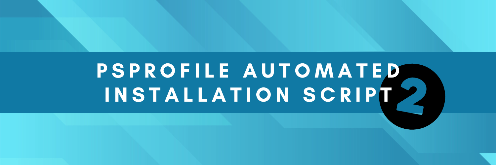
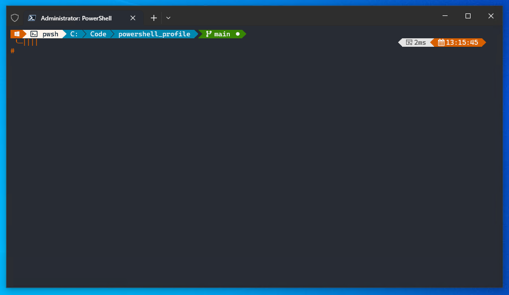

# Welcome to the PSProfile - Two &#9679; Point &#9679; Zero

### Pre-requites Applications required: 
> Microsoft.WindowsTerminal \
> Microsoft.PowerShell \
> Microsoft.VisualStudioCode 
> 
<details>
<summary>Manual Installation of Packages</summary>

#### Microsoft.WindowsTerminal 
```
winget.exe install --exact --silent --id Microsoft.WindowsTerminal
```

#### Microsoft.PowerShell
```
winget.exe install --exact --silent --id Microsoft.PowerShell
```

#### Microsoft.VisualStudioCode
```
winget.exe install --exact --silent --id Microsoft.VisualStudioCode --scope machine
```
</details>

## New Computer Setup (Fresh OS Deployment)
During the setup of the PsProfile Script the following Packages will be installed on your local machine 

### Pre-requsite checks - winget modules (This will probably already be installed)
 - Microsoft.WindowsTerminal
 - Microsoft.PowerShell*
 - Microsoft.VisualStudioCode \
'*' If installed from winget it installs under `"C:\Program Files\PowerShell\7\pwsh.exe"`

### PowerShell Modules
 - PackageManagement [PowerShell 5.0]
 - PowerShellGet [PowerShell 5.0]
 - PSReadLine [PowerShell 5.0]
 - Pester [PowerShell 5.0]
 - Posh-Git [PowerShell 7.0] [PowerShell 5.0]
 - Terminal-Icons [PowerShell 7.0] [PowerShell 5.0]
 - Az [PowerShell 7.0] [PowerShell 5.0]

During the installation of the PowerShell Modules they are installed to the `"%PROGRAMFILES%\WindowsPowerShell\Modules"` \
this allows for cross-version module import from PowerShell 5.1 and PowerShell 7.0

### Winget Modules
 - JanDeDobbeleer.OhMyPosh
 - Git.Git
 - Github.Cli
 - Microsoft.AzureCLI
 - Microsoft.Azure.Kubelogin
 - Kubernetes.kubectl
 - Helm.Helm

### Nerd Font Installation
Obviously using Oh-My-Posh required a [Nerd Font](https://www.nerdfonts.com/font-downloads) of choice. \
For this setup script, my chosen font is: [CaskaydiaCove Nerd Font](https://github.com/ryanoasis/nerd-fonts/releases/download/v3.0.2/CascadiaCode.zip) \
Specially this ttf font style: `*CaskaydiaCoveNerdFont-Regular.ttf*`

For the VSCode Font Family settings you will want to use:
```
Consolas, 'Courier New', 'CaskaydiaCove Nerd Font'
```

### Installation Time

#### Download the zip file and extract 
```
Invoke-WebRequest -Uri "https://github.com/smoonlee/powershell_profile/archive/refs/heads/main.zip" -Outfile "$([Environment]::GetFolderPath("Desktop"))\psprofile.zip"
```

#### Extract Zip file
```
Expand-Archive -Path "$([Environment]::GetFolderPath("Desktop"))\psprofile.zip" -DestinationPath "$([Environment]::GetFolderPath("Desktop"))\psprofile"
```

```
Set-Location -Path "$([Environment]::GetFolderPath("Desktop"))\psprofile\oh-my-posh-profile-main"
```

#### Execute New-PsProfile Script
```
.\New-PsProfile.ps1
```

## PsProfile Reset 

### ⚠️ -  WARNING - What the Profile Reset removes 
During the Profile Reset, The cleanup script will remove the source PowerShell folders from your Documents folder and reset the Windows Terminal settings.json file.

 - PowerShell 7.0 \
    `%USERPROFILE%\Documents\PowerShell`

- PowerShell 5.1 \
    `%USERPROFILE%\Documents\WindowsPowershell`

- Windows Terminal (settings.json) \
    `%LOCALAPPDATA%\Packages\Microsoft.WindowsTerminal_8wekyb3d8bbwe\LocalState\settings.json`

#### Clone Github Repository
```
git clone https://github.com/smoonlee/powershell_profile.git
```

#### Enter Github Repository Folder
```
Set-Location -Path <path-to-git-clone-folder>
```

#### Execute PsProfile
```
New-PsProfile.ps1 -ResetProfile
```

### Windows Terminal Preview 


