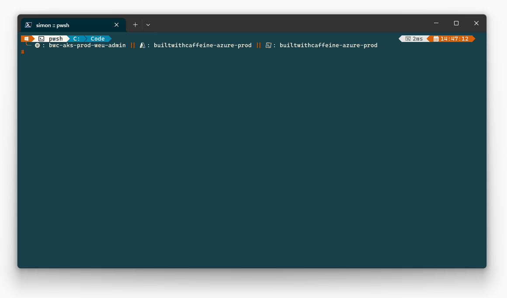

# Oh-My-Posh :: Overview :: Mk3



> [!IMPORTANT]
> #Requires -RunAsAdministrator \
> This script requires execution as Administrator, for Nerd Font Installation!

## Release Notes

> **AUGUST 2024** \
> Verbose Formatting Improvements for Update-PSProfile
> Updated Oh My Posh Theme, Added AWS Support, Renamed to quick-term-cloud.omp.json
> Updated New-OhMyPoshProfile.ps1 \
> Added Amazon.AWSCLI WinGet Package \
> Added Hashicorp.Terraform WinGet Package \
> Added Get-EolInfo \
> Added Get-PSProfileVersion
>
> **JULY 2024** \
> Added Microsoft.Graph Module \
> Added Get-NetAddressSpace Function \
> Fixed Update-PSProfile Function \
> Created Release Pipeline for Production and Development \
> Added Update-PSProfile & Register-PSProfile \
> Added Get-AksVersion Function \
> Updated Remove-GitBranch \
> Script Formatting Improvements
>
> **JUNE 2024** \
> Added Get-DnsResult Function \
> Renamed Get-PublicIPAddress to Get-MyPublicIP
>
> **MAY 2024** \
> Rebuilt Functions for Installation \
> Added custom PowerShell Functions: \
> Get-PublicIP, \
> Get-SystemUptime, \
> Get-AzSystemUptime, \
> Register-PSProfile, \
> Update-WindowsApps, \
> Remove-GitBranch \
> Added Support for AKS Clusters \
> Added Module Intellisense (Set-PSReadlineKeyHandler -Key Tab -Function MenuComplete) \
> Move PowerShell Modules back to User Documents \
> Rebuilt WSL/Linux bash script

## Improvements Over Mk2

Since the release of the Mk2 Profile back in August 2023, I've learnt and realised that the PowerShell modules don't need to be installed directly in the `C:\Program Files\WindowsPowerShell\Modules` folder to get cross platform/version support.
Having completed a lot of testing with some virtual machines, I worked out that you can use: `C:\Users\%UserName%\Documents\PowerShell\Modules` or `C:\Users\%UserName%\Documents\WindowsPowerShell\Modules`\
 By creating symbolic links between the two folder paths, you can import modules across both PowerShell versions.

While doing some research as well around `$PROFILE` tips and tricks, I found some super interesting links:

[Chris Titus Tech - Pretty PowerShell](https://github.com/ChrisTitusTech/powershell-profile) \
[Scott Hanselman - My Ultimate PowerShell Prompt](https://www.hanselman.com/blog/my-ultimate-powershell-prompt-with-oh-my-posh-and-the-windows-terminal) \
[Scott Hanselman - Customizing you Powershell prompt with PSReadLine](https://www.hanselman.com/blog/you-should-be-customizing-your-powershell-prompt-with-psreadline) \
[Anit Jha - Elevate your Windows PowerShell](https://blog.anit.dev/elevate-your-windows-powershell-my-personal-customization-guide)

## Modules, Functions and Applications Overview

### PowerShell Modules

 - [PackageManagement](https://www.powershellgallery.com/packages/PackageManagement)
 - [PowerShellGet](https://www.powershellgallery.com/packages/PowerShellGet)
 - [PSReadLine](https://www.powershellgallery.com/packages/PSReadLine)
 - [Pester](https://www.powershellgallery.com/packages/Pester)
 - [Posh-Git](https://www.powershellgallery.com/packages/posh-git)
 - [Terminal-Icons](https://www.powershellgallery.com/packages/Terminal-Icons)
 - [Microsoft.Graph](https://www.powershellgallery.com/packages?q=Microsoft+Graph)
 - [Az](https://www.powershellgallery.com/packages/Az)

### Winget Modules

 - [JanDeDobbeleer.OhMyPosh](https://winstall.app/apps/JanDeDobbeleer.OhMyPosh)
 - [Git.Git](https://winstall.app/apps/Git.Git)
 - [Github.Cli](https://winstall.app/apps/GitHub.cli)
 - [Microsoft.AzureCLI](https://winstall.app/apps/Microsoft.AzureCLI)
 - [Microsoft.Azure.Kubelogin](https://winstall.app/apps/Microsoft.Azure.Kubelogin)
 - [Kubernetes.kubectl](https://winstall.app/apps/Kubernetes.kubectl)
 - [Helm.Helm](https://winstall.app/apps/Helm.Helm)
 - [Ookla.Speedtest.CLI](https://winstall.app/apps/Ookla.Speedtest.CLI)
 - [Hashicorp.Terraform](https://winstall.app/apps/Hashicorp.Terraform)
 - [Amazon.AWSCLI](https://winstall.app/apps/Amazon.AWSCLI)

### PowerShell Functions

[x] Azure CLI Tab Completion \
<br>
Microsoft Docs Link: [here](https://learn.microsoft.com/en-us/cli/azure/install-azure-cli-windows?tabs=azure-cli#enable-tab-completion-in-powershell)

[x]> Get your current Public IP Address
``` powershell
Get-MyPublicIp
```

[x]> Get Local System Uptime

``` powershell
Get-SystemUptime
```

[x]> Get-SystemUptime - Example
``` powershell
Hostname: XPS9510-SL
Uptime: 0 days, 4 hours, 6 minutes, 47 seconds
Last Reboot Time: 05/06/2024 10:10:32
```

[x]> Get Uptime of Virtual Machine in Azure

``` powershell
Get-AzSystemUptime -resourceGroup <resourceGroup> -vmName <vmName> -subscriptionId <subscriptionId>
```

[x]> Get-AzSystemUptime - Example (Windows)
``` powershell
[Azure] :: Getting System Uptime for windows01 in rg-bwc-sandbox-weu...
WARNING: This may take up to 35 seconds

[Azure] :: Hostname: windows01
[Azure] :: Uptime: 15 days, 4 hours, 25 minutes, 46 seconds
[Azure] :: Last Reboot Time: 06/05/2024 13:19:45
```

[x]> Get-AzSystemUptime - Example (Linux)
``` powershell
[Azure] :: Getting System Uptime for vm-learn-linux-weu in rg-learn-linux-weu...
WARNING: This may take up to 35 seconds

[Azure] :: Hostname: vm-learn-linux-weu
[Azure] :: Uptime: up 1 day, 1 hour, 54 minutes
[Azure] :: Last Reboot Time: 2024-05-05 11:27:17
```

[x]> Reload PowerShell Profile

``` powershell
Register-PSProfile
```
[x]> Update PowerShell Profile

Update PSProfile to Latest Production Release
``` powershell
Update-PSProfile
```

[x]> Update PSProfile to Latest Development Release
``` powershell
Update-PSProfile -devMode
```

[x]> Update Windows Applications (Using WinGet)

``` powershell
Update-WindowsApps
```

[x]> Update-WindowsApps - Examples

``` powershell
Updating Windows Applications...

Name            Id                 Version Available Source
-----------------------------------------------------------
Hugo (Extended) Hugo.Hugo.Extended 0.125.5 0.125.6   winget
1 upgrades available.
```

[x]> Remove-GitBranch (Singe Branch) (custom Default Branch)
<br>

For example, If you are not using `main`
``` powershell
Remove-GitBranch -branchName <branchname> -defaultBranch <deafultBranch>
```

[x]> Remove-GitBranch (Singe Branch)
``` powershell
Remove-GitBranch -branchName <branchname>
```

[x]> Remove-GitBranch -branchName - Example
``` powershell
Deleted branch branch1 (was b7ef979).
```

[x]> Remove-GitBranch (All Branches)
> This excludes 'main' and 'master' branches

``` powershell
Remove-GitBranch -all
```

[x]> Remove-GitBranch -all - Example
``` powershell
WARNING: This will remove all local branches in the repository!
Press any key to continue...

[Git] :: Moving to main branch
Switched to branch 'main'
Your branch and 'origin/main' have diverged,
and have 8 and 1 different commits each, respectively.
  (use "git pull" if you want to integrate the remote branch with yours)

[Git] :: Starting Branch Cleanse
Deleted branch branch1 (was b7ef979).
Deleted branch branch2 (was b7ef979).
Deleted branch branch3 (was b7ef979).
Deleted branch branch4 (was b7ef979).
Deleted branch branch5 (was b7ef979).
```

[x]> Get-DnsReuslt
> Query DNS direct from the shell 👌

``` powershell
Get-DnsResult -domain builtwithcaffeine.cloud -recordType NS
```

[x]> Get-DnsResults - Example
``` powershell
Name                           Type   TTL   Section    NameHost
----                           ----   ---   -------    --------
builtwithcaffeine.cloud        NS     86400 Answer     ns1-02.azure-dns.com
builtwithcaffeine.cloud        NS     86400 Answer     ns2-02.azure-dns.net
builtwithcaffeine.cloud        NS     86400 Answer     ns3-02.azure-dns.org
builtwithcaffeine.cloud        NS     86400 Answer     ns4-02.azure-dns.info
```

Supported RecordTypes:
>
> A           ALL         DNAME       ISDN        MG          NS          NULL        RRSIG       X25 \
> A_AAAA      ANY         DNSKEY      MB          MINFO       NSEC        OPT         RT          TXT \
> AAAA        CNAME       DS          MD          MR          NSEC3       PTR         SOA         WINS \
> AFSDB       DHCID       HINFO       MF          MX          NSEC3PARAM  RP          SRV         WKS
>

[x]> Get-NetAddressSpace \
Ever wanted to quickly check an address space for IPv4 or IPv6? Well now you can 🫡

``` powershell
Get-NetAddressSpace -cidr  "192.168.0.0/21"
```

> IPv4
``` powershell
CIDR             : 192.168.0.0/21
NetworkAddress   : 192.168.0.0
FirstUsableIP    : 192.168.0.1
LastUsableIP     : 192.168.7.254
BroadcastAddress : 192.168.7.255
UsableHostCount  : 2046
```

> IPv6
``` powershell
CIDR             : 2001:db8::/64
NetworkAddress   : ::
FirstUsableIP    : ::1
LastUsableIP     : ::ffff:ffff:ffff:fffe
BroadcastAddress : ::ffff:ffff:ffff:ffff
UsableHostCount  : 18446744073709551614
```

[x]> Get-PSProfileVersion \
Check the local profile version
```
Latest Profile Release: 3.1.16.1-prod
Current Local Profile Version: 3.1.16.1-prod
```

[x]> Get-EolInfo \
Ever wanted to know when something is going to expire? The peoples over at https://endoflife.date and created a public API we can query

> This shows all version of a product for example `windows` or `windows-server`
```
Get-EolInfo -productName <productname>
```

> [!TIP]
> After -productName, Hit Tab for the 334 possibilities? \
> or check https://endoflife.date/ for a more visual overview

```
cycle           : 23H2
releaseDate     : 2023-10-24
eol             : 2025-10-24
latest          : 10.0.25398
link            : https://learn.microsoft.com/lifecycle/products/windows-server-annual-channel
lts             : False
support         : 2025-04-24
extendedSupport : False

cycle           : 2022
releaseDate     : 2021-08-18
eol             : 2031-10-14
latest          : 10.0.20348
lts             : True
link            : https://learn.microsoft.com/windows/release-health/windows-server-release-info
support         : 2026-10-13
extendedSupport : False

cycle           : 20H2
releaseDate     : 2020-10-20
eol             : 2022-08-09
latest          : 10.0.19042
link            : https://learn.microsoft.com/lifecycle/announcements/windows-server-20h2-retiring
lts             : False
support         : 2022-08-09
extendedSupport : False

cycle           : 2004
releaseDate     : 2020-05-27
eol             : 2021-12-14
latest          : 10.0.19041
link            : https://learn.microsoft.com/lifecycle/announcements/windows-server-version-2004-end-of-servicing
lts             : False
support         : 2021-12-14
extendedSupport : False

cycle           : 1909
releaseDate     : 2019-11-12
eol             : 2021-05-11
latest          : 10.0.18363
link            : https://learn.microsoft.com/lifecycle/announcements/windows-server-1909-end-of-servicing
lts             : False
support         : 2021-05-11
extendedSupport : False

cycle           : 1903
releaseDate     : 2019-05-21
eol             : 2020-12-08
latest          : 10.0.18362
link            : https://learn.microsoft.com/lifecycle/products/windows-server-semiannual-channel
lts             : False
support         : 2020-12-08
extendedSupport : False

cycle           : 1809
releaseDate     : 2018-11-13
eol             : 2020-11-10
latest          : 10.0.17763
link            : https://learn.microsoft.com/lifecycle/announcements/windows-server-1809-end-of-servicing
lts             : False
support         : 2020-11-10
extendedSupport : False

cycle           : 2019
releaseDate     : 2018-11-13
lts             : True
eol             : 2029-01-09
latest          : 10.0.17763
link            : https://learn.microsoft.com/windows/release-health/windows-server-release-info
support         : 2024-01-09
extendedSupport : False

cycle           : 1803
releaseDate     : 2018-04-30
eol             : 2019-11-12
latest          : 10.0.17134
link            : https://learn.microsoft.com/lifecycle/announcements/windows-server-1803-end-of-servicing
lts             : False
support         : 2019-11-12
extendedSupport : False

cycle           : 1709
releaseDate     : 2017-10-17
eol             : 2019-04-09
latest          : 10.0.16299
link            : https://techcommunity.microsoft.com/t5/windows-server-for-developers/windows-server-version-1709-lifecycle-announcement/m-p/379766
lts             : False
support         : 2019-04-09
extendedSupport : False

cycle           : 2016
releaseDate     : 2016-10-15
lts             : True
eol             : 2027-01-12
latest          : 10.0.14393
link            : https://learn.microsoft.com/windows/release-health/windows-server-release-info
support         : 2022-01-11
extendedSupport : False

cycle           : 2012-R2
releaseDate     : 2013-11-25
lts             : True
eol             : 2023-10-10
latest          : 6.3.9600
link            : https://learn.microsoft.com/lifecycle/products/windows-server-2012-r2
support         : 2018-10-09
extendedSupport : 2026-10-13

cycle           : 2012
lts             : True
releaseDate     : 2012-10-30
eol             : 2023-10-10
latest          : 6.2.9200
link            : https://learn.microsoft.com/lifecycle/products/windows-server-2012
support         : 2018-10-09
extendedSupport : 2026-10-13

cycle           : 2008-R2-SP1
releaseDate     : 2011-02-22
lts             : True
eol             : 2020-01-14
latest          : 6.1.7601
link            : https://learn.microsoft.com/lifecycle/products/windows-server-2008-r2
support         : 2015-01-13
extendedSupport : 2023-01-10

cycle           : 2008-SP2
releaseDate     : 2009-04-29
lts             : True
eol             : 2020-01-14
latest          : 6.0.6003
link            : https://learn.microsoft.com/lifecycle/products/windows-server-2008
support         : 2015-01-13
extendedSupport : 2023-01-10

cycle           : 2003-SP2
releaseDate     : 2003-04-24
lts             : True
eol             : 2015-07-14
latest          : 5.2.3790
link            : https://learn.microsoft.com/lifecycle/products/windows-server-2003-
support         : 2010-07-13
extendedSupport : False

cycle           : 2000
releaseDate     : 2000-02-17
lts             : True
eol             : 2010-07-13
latest          : 5.0.2195
link            :
support         : 2005-06-30
extendedSupport : False
```


> Get products with current vender support
```
Get-EolInfo -productName <productname> -activeSupport
```

```
cycle           : 23H2
releaseDate     : 2023-10-24
eol             : 2025-10-24
latest          : 10.0.25398
link            : https://learn.microsoft.com/lifecycle/products/windows-server-annual-channel
lts             : False
support         : 2025-04-24
extendedSupport : False

cycle           : 2022
releaseDate     : 2021-08-18
eol             : 2031-10-14
latest          : 10.0.20348
lts             : True
link            : https://learn.microsoft.com/windows/release-health/windows-server-release-info
support         : 2026-10-13
extendedSupport : False

cycle           : 2019
releaseDate     : 2018-11-13
lts             : True
eol             : 2029-01-09
latest          : 10.0.17763
link            : https://learn.microsoft.com/windows/release-health/windows-server-release-info
support         : 2024-01-09
extendedSupport : False

cycle           : 2016
releaseDate     : 2016-10-15
lts             : True
eol             : 2027-01-12
latest          : 10.0.14393
link            : https://learn.microsoft.com/windows/release-health/windows-server-release-info
support         : 2022-01-11
extendedSupport : False


```

> Get products with Long Term Services/Support
```
Get-EolInfo -productVersion <productname> -ltsSupport
```

```
cycle             : 24.04
codename          : Noble Numbat
lts               : True
releaseDate       : 2024-04-25
eol               : 2029-04-25
latest            : 24.04
latestReleaseDate : 2024-04-25
support           : 2029-04-25
extendedSupport   : 2036-04-25

cycle             : 22.04
codename          : Jammy Jellyfish
lts               : True
releaseDate       : 2022-04-21
eol               : 2027-04-01
latest            : 22.04.4
latestReleaseDate : 2024-02-22
support           : 2024-09-30
extendedSupport   : 2032-04-09

cycle             : 20.04
codename          : Focal Fossa
lts               : True
releaseDate       : 2020-04-23
eol               : 2025-04-02
latest            : 20.04.6
latestReleaseDate : 2023-03-23
support           : 2022-10-01
extendedSupport   : 2030-04-02

```

## Windows Terminal Nerd Font

Nerd Fonts patches developer targeted fonts with a high number of glyphs (icons). Specifically to add a high number of extra glyphs from popular 'iconic fonts'
You can get yours here: [Nerd Font](https://www.nerdfonts.com/font-downloads)

Using the `New-OhMyPoshProfile.ps1` it will auto install the `Cascadia Code` Font. \
The font file which is installed is the: `CaskaydiaCoveNerdFont-Regular.ttf` \
If you want to add this support to Visual Studio Code, you can update the Font Family:

``` powershell
'Consolas', 'Courier New', 'CaskaydiaCove Nerd Font'
```

## Pre Device Setup

> [!IMPORTANT]
> If you've used the v2 setup, You'll manually need to remove Modules from \
> pwsh7 :: C:\Program Files\PowerShell\Modules \
> pwsh5 :: C:\Program Files\WindowsPowerShell\Modules

### PowerShell 5 default modules

``` powershell
Directory: C:\Program Files\WindowsPowerShell\Modules

Mode                 LastWriteTime         Length Name
----                 -------------         ------ ----
d-----        07/05/2022     06:42                Microsoft.PowerShell.Operation.Validation
d-----        07/05/2022     06:42                PackageManagement
d-----        07/05/2022     06:42                Pester
d-----        07/05/2022     06:42                PowerShellGet
d-----        07/05/2022     06:42                PSReadLine
```

## Profile Setup

### -> Windows

<details>
<summary> New Device Setup </summary>

<br>
Ensure that you can execute scripts on your local machine
<br>

``` powershell
Set-ExecutionPolicy -Scope 'CurrentUser' -ExecutionPolicy 'RemoteSigned' -Force
```

Download and execute the New-PSProfile.ps1 script.

``` powershell
git clone https://github.com/smoonlee/oh-my-posh-profile.git ; Set-Location oh-my-posh-profile ; .\New-OhMyPoshProfile.ps1
```
</details>

### -> Linux

<details>
<summary> New Device Setup </summary>
<br>

``` bash
setupUrl='https://raw.githubusercontent.com/smoonlee/oh-my-posh-profile/main/New-OhMyPoshProfile.sh'
curl -s $setupUrl -o $HOME/New-OhMyPoshProfile.sh ; bash New-OhMyPoshProfile.sh
```

</details>

<details>
<summary> WSL :: Kubernetes </summary>
<br>

> **NOTE** \
> Since Mk3, This is built into the setup script!

You might need to create the `.kube` folder first.

``` bash
mkdir $HOME/.kube
```

Then create a symbolic link to the Windows `.kube` folder.

> **NOTE** \
> Please update the Users folder to match your Windows User folder

``` bash
ln -sf /mnt/c/Users/<username>/.kube/config $HOME/.kube/config
```
</details>
